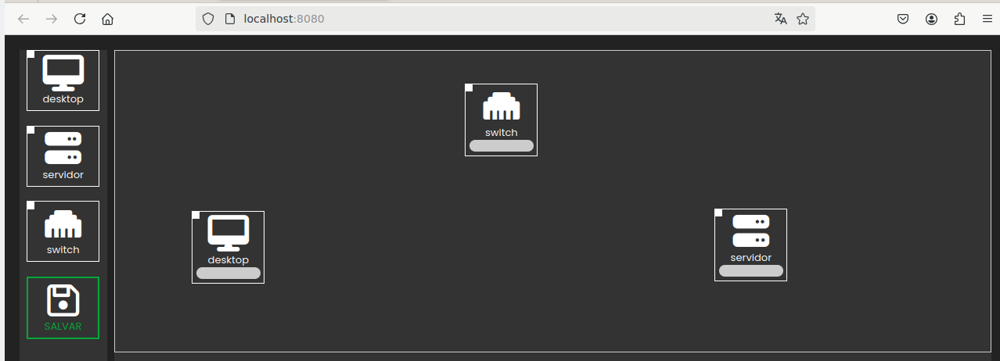

# 🥷 SECURITY SCENARIO MNG

Recurso Educacional Aberto (REA) para auxiliar em aulas práticas em disciplinas de Segurança de Sistemas de Informação, Redes de Computadores e Sistemas Operacionais.

### 💻 Tutorial de instalação da ferramenta:

1. `sudo apt install nodejs npm node-http-server`
2. `sudo npm install -g http-server`
3. `http-server`

Após a instalação acesse http://localhost:8080 para acessar a ferramenta

## COPYRIGHT
 It's licensed under a <a rel="license" href="http://creativecommons.org/licenses/by/4.0/">Creative Commons Attribution 4.0 International License</a>. The licensor cannot revoke these freedoms as long as you follow the license terms:

* __Attribution__ — You must give __appropriate credit__ like below:

MOREIRA, João G. A., FREITAS, Bruno P. T., LAZARIN, Nilson M. (2024).
GESTÃO DE CENARIOS NO ENSINO DE SEGURANÇA CIBERNÉTICA. Projeto de Ensino do Cefet/RJ, Edital DIREN No 01/2024.

